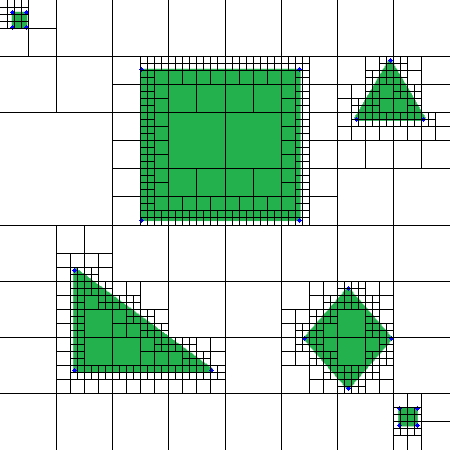

# Quadtree-based-Dijkstras-Search

This project aims to improve the search speed of conventional graph based algorithms by combining them with the approximate cell decomposition techniques. Here, quadtree decomposition is used to generate a variable node size graph (having higher resolution at the obstacle edges and lower resolution in the free space) and dijkstra's search algorithm is applied on that graph to search for the shortest path. Furthermore other algorithms like A star can also be applied on the same graph.

One noteworthy thing to observe is, we ge the sub-optimal path because of the larger grid size in free space, but we get better search times. So here optimality is a trade off with grid search time.

### Input Grid

### Quadtree Decomposition

### Dijkstra's Search

